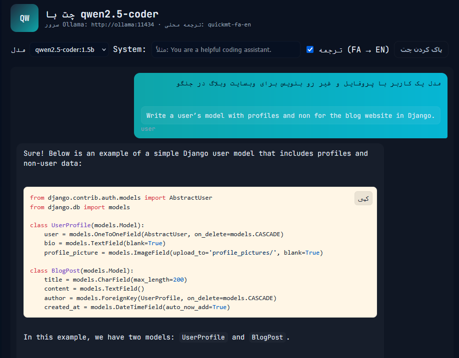
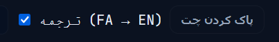
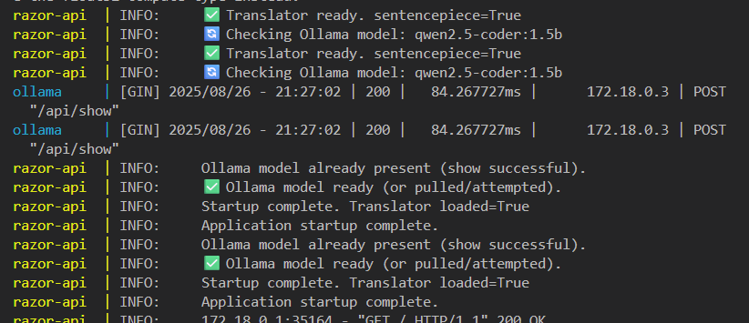

## 🏷️ Badges


---

## 🖼️ تصاویر

**تصویر کلی پروژه**  



---

## ⚡ خلاصه (فارسی)

Razor-AI یک لایه واسط برای **ارتباط بهتر مدل‌های Ollama با ورودی فارسی** است. متن فارسی به صورت آفلاین با مدل **quickmt-fa-en** ترجمه می‌شود، بلوک‌های کد و `inline code` حفظ می‌شوند، سپس به Ollama فرستاده می‌شوند.  

قابلیت‌ها:
- ترجمه آفلاین Fa → En با **CTranslate2**

**تصویر مربوط به گزینه‌ی ترجمه**  


- حفظ بلوک‌های کد (` ```...``` `) و inline code
- UI زیبا با قابلیت **کپی بلوک کد**
- دانلود خودکار مدل ترجمه اگر موجود نباشد
- پشتیبانی GPU برای Ollama
- تغییر مدل Ollama با ویرایش `OLLAMA_MODEL`


## 🚀 راه‌اندازی سریع با Docker

```bash
# ساخت و اجرای کانتینرها
docker compose build --no-cache
docker compose up -d
```
---
open http://localhost:8000
---




## تغییر مدل Ollama

 yaml
Copy code
```
# docker-compose.yml
environment:
  - OLLAMA_MODEL=qwen2.5-coder:1.5b #اینو تغییر بده
```


```bash
Copy code
# کلون کردن repo quickmt
git clone https://github.com/quickmt/quickmt.git
```


# دانلود مدل فارسی → انگلیسی
quickmt-model-download quickmt/quickmt-fa-en ./quickmt-fa-en
🖥️ GPU
نصب NVIDIA driver + nvidia-container-toolkit

اجرای Ollama با GPU:

bash
Copy code
docker run --gpus all -e OLLAMA_USE_GPU=1 -p 11434:11434 ollama/ollama:latest
اگر GPU موجود نباشد، Ollama روی CPU fallback می‌کند.

🧩 الگوریتم ترجمه امن
متن را به بخش‌های کد و متن عادی تقسیم کن (regex برای ...).

بخش‌های متن عادی را به quickmt-fa-en بده.

بلوک‌های کد و inline code دست نخورده باقی بمانند.

خروجی ترجمه شده را به Ollama بفرست.

📝 شبکه‌های اجتماعی
Twitter/X: @sepy_dev

GitHub: sepehr.ramzany

Instagram: sepehr.ramzany

Email: sepehr.ramzany@gmail.com

🇬🇧 English Summary
Razor-AI is a local interface to improve Persian input with Ollama models. Persian text is translated offline using quickmt-fa-en (CTranslate2), code blocks are preserved, then sent to Ollama. Docker + GPU ready. Toggle translation per message in the UI.

Quick Start:

bash
Copy code
git clone https://github.com/your/repo.git
docker compose build --no-cache
docker compose up -d
open http://localhost:8000
Change Ollama model: OLLAMA_MODEL=qwen2.5-coder:1.5b
GPU Notes: Use docker run --gpus all ... for GPU, fallback to CPU if unavailable.
Model Download: Prefer host download or entrypoint.sh auto-download.
License: MIT

yaml
Copy code


